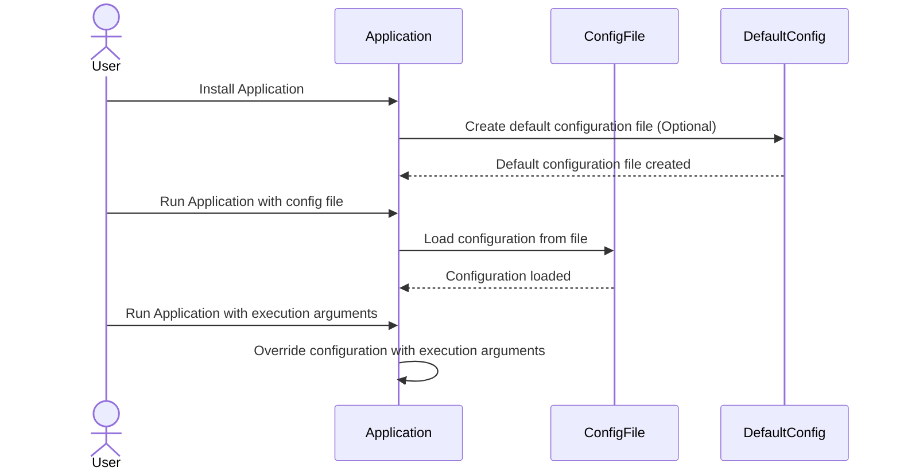
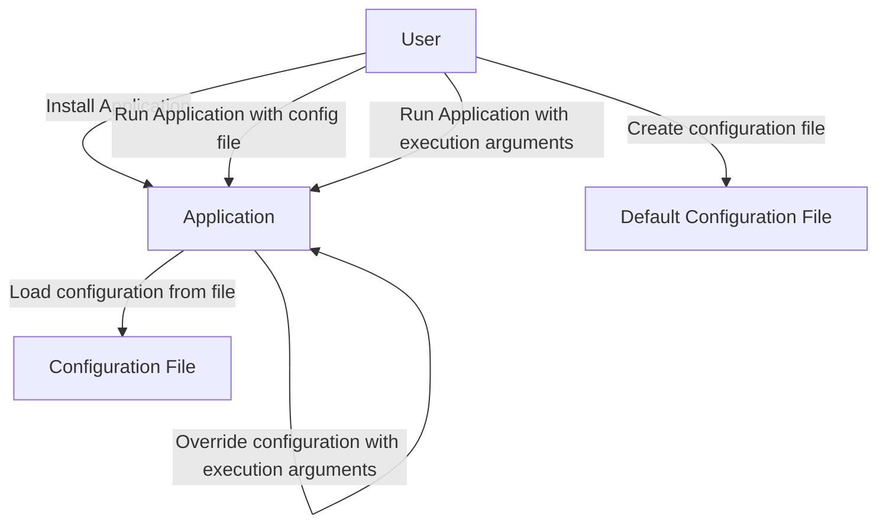
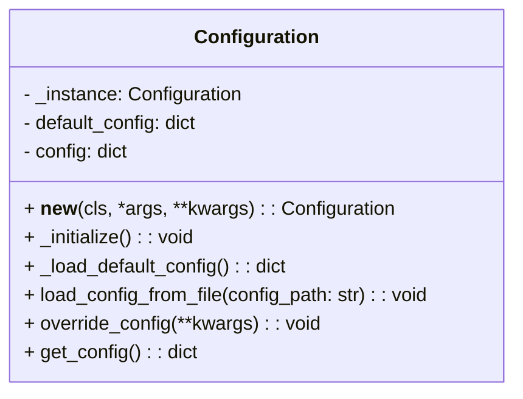

# Configuration requirements

1) The application must have a default configuration established at installation
2) A default configuration file can be created at the installation dir
    - A template is given at installation
3) Configuration can be updated using a file as an execution argument
4) Concrete configuration values can be updated by execution argument

The configuration will resolve as:
1) Concrete values given by execution argument
2) Values in the configuration file given as argument
3) values in default configuration file. If exists
4) Default values at application level

# Sequence Diagram

### User Use Case Diagram

## Class Diagram

### Explanation:
- **Attributes**:
  - `_instance`: Singleton instance of the `Configuration` class.
  - `default_config`: Dictionary holding the default configuration values.
  - `config`: Dictionary holding the current configuration values.
- **Methods**:
  - `__new__`: Ensures only one instance of the class is created.
  - `_initialize`: Initializes the configuration by loading the default configuration.
  - `_load_default_config`: Loads the default configuration from a YAML file.
  - `load_config_from_file`: Loads configuration values from a specified YAML file.
  - `override_config`: Overrides configuration values at runtime.
  - `get_config`: Returns the current configuration.